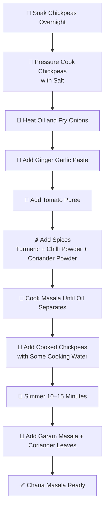

# 🍛 Kabuli Chenna Masala

This document explains **what to prepare first**, **how to keep ingredients ready**, and **the complete cooking flow** for Chenna Masala.

---

## 🛒 Ingredients Checklist

### Main Ingredients
- Kabuli Chenna – 1 cup
- Onion – 1 (big or small)
- Tomato – 1
- Ginger Garlic Paste - 1 Spoon
- Oil – 4 teaspoons (total)
- Salt – As required
- Fresh coriander (optional)

### Whole Spices
- Elaichi (Cardamom) – 1
- Cloves – 2
- Cinnamon – 1 small piece

### Spice Powders
- Coriander powder – 1 tablespoon
- Red chilli powder – As required ( 3 spoons)
- Turmeric powder – ½ teaspoon
- Chenna Masala Powder - (2 Spoons)
> ⚠️ **Cashew**: Optional (Not recommended for Rajma as per your note) -- 4 Full Cashews/ 6 Broken Cashews

---

## 🕒 Preparation Timeline

### 🌙 Night Before (Mandatory)
1. Wash the **Kabuli Chenna** thoroughly.
2. Soak in enough water overnight (minimum 8 hours).

---

### 🌅 Morning Preparation

#### Step 1: Boil Rajma
1. Drain soaked water.
2. Add fresh water + salt.
3. Pressure cook until soft (4–5 whistles).
4. Keep aside with the water.

---

## 🔪 Cutting & Prepping (Do This Before Cooking)

1. **Onion** – Chop finely
2. **Tomato** – Chop roughly
3. **Ginger + Garlic** – Chop or crush (Optional)
4. Measure all spices and keep ready

👉 Keep everything ready before switching on the stove.

---

## 🍳 Cooking Process

### Step 2: First Pan Fry
1. Heat a pan
2. Add **2 teaspoons oil**
3. Add chopped onion
   - Fry till **golden brown**
4. Add ginger + garlic Paste
5. Add chopped tomato
6. Close lid and cook for **5 minutes** on medium flame

➡️ Cool it and Grind into a **smooth paste**

---

### Step 3: Masala Paste (Mixy)
Add the following to a mixer jar:

1. Cooked pan mixture
2. Elaichi – 2
3. Cloves – 2
4. Cinnamon – 1 small piece
5. Coriander powder – 1 teaspoon
6. Salt – As required
7. Chilli powder – As required
8. Turmeric powder – ½ teaspoon
9. Cashew

➡️ Grind into a **smooth paste**

---

### Step 4: Final Cooking

1. Heat the same pan
2. Add **2 teaspoons oil**
3. Add prepared masala paste, Onion and Tomato Paste, and add **Chenna Masala (2 Spoons)**
   - Stir continuously
   - Cook till **color changes** and oil separates
4. Add the Kabuli Chenna (along with some water if Needed)
5. Mix well
6. Simmer on **low flame**, close lid for **2 minutes**

---

### Step 5: Finishing Touch
- Add fresh coriander if available
- Switch off flame
- Rest for 5 minutes before serving

---

## 🍽️ Serving Suggestions
- Serve hot with **rice**, **jeera rice**, or **roti**
- Tastes even better after resting for some time 😄

---

## ✅ Summary Flow
## 🔄 Summary Flow

---