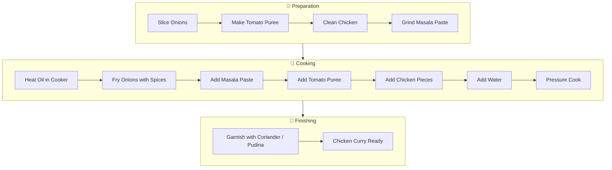

# 🍗 Chicken Curry

This document explains what to prepare first, how to keep ingredients
ready, and the complete cooking flow for Chicken Curry.

------------------------------------------------------------------------

## 🛒 Ingredients Checklist

### Main Ingredients

-   Chicken -- 1 KG
-   Onions -- 2 (thinly sliced)
-   Tomatoes -- 2 (make paste / puree)
-   Oil -- As required
-   Salt -- As required
-   Water -- As needed
-   Coriander leaves / Pudina -- For garnish

### Whole Spices (For Masala)

-   Elaichi (Cardamom) -- 2
-   Cloves -- 5
-   Biryani Bark / Cinnamon -- 2 small pieces
-   Poppy seeds -- Small quantity
-   Cashew nuts -- 5--6
-   Coconut -- 3 small pieces

### Spice Powders & Pastes

-   Ginger Garlic Paste -- As required
-   Coriander Powder -- 1--2 big spoons
-   Red Chilli Powder -- As required
-   Turmeric Powder -- As required

------------------------------------------------------------------------

## 🔪 Cutting & Prepping (Do This Before Cooking)

1.  Slice onions thinly
2.  Prepare tomato paste / puree
3.  Clean and wash chicken
4.  Keep all spices measured and ready

👉 Keeping everything ready makes cooking smooth and stress‑free.

------------------------------------------------------------------------

## 🌀 Step 1: Masala Paste (Mixy)

Add the following to a mixer jar:

-   Elaichi -- 2
-   Cloves -- 5
-   Biryani Bark -- 2 small pieces
-   Ginger Garlic Paste
-   Coriander Powder
-   Poppy seeds
-   Coconut pieces
-   Cashew nuts

➡️ Grind into a smooth paste. Add a little water if needed.

------------------------------------------------------------------------

## 🍳 Step 2: Cooker Base

1.  Heat oil in cooker
2.  Add sliced onions
3.  Add salt, chilli powder, and turmeric powder
4.  Fry till onions turn golden brown

------------------------------------------------------------------------

## 🍛 Step 3: Building the Curry

1.  Add prepared masala paste
    -   Fry for a short time to remove raw smell
2.  Add a little extra chilli powder (optional)
3.  Add tomato puree
4.  Add chicken pieces
5.  Mix well

------------------------------------------------------------------------

## 🔥 Step 4: Pressure Cooking

1.  Cook on slow flame for about 5 minutes
2.  Add water if required for gravy
3.  Close cooker lid
4.  Cook for 5--6 whistles

------------------------------------------------------------------------

## 🌿 Step 5: Finishing Touch

-   Garnish with coriander leaves or pudina
-   Rest for a few minutes before serving

------------------------------------------------------------------------

## 🍽️ Serving Suggestions

-   Serve hot with rice, roti, or chapati

------------------------------------------------------------------------

## ✅ Summary Flow

Prep → Grind Masala → Fry Onions → Add Masala → Add Tomato → Add Chicken
→ Pressure Cook → Garnish → Serve

## 🔄 Summary Flow

