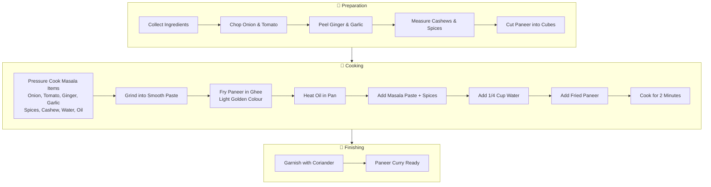

# 🍛 Panner Curry Recipe

---

## 🛒 Ingredients

### 🥕 Fresh Vegetables
- Onion  
- Tomato  
- Ginger  
- Garlic  
- Coriander (for garnish)

### 🌶️ Spices
- Cinnamon
- Elaichi (Cardamom)
- Clove
- Chilli Powder
- Turmeric Powder
- Pepper Powder
- Salt

### 💧 Fluids
- Water
- Oil

### 🧊 Refrigerated Products
- Panner
- Ghee

### 🌰 Dry Fruits
- Cashew

---

## 🔪 Cutting & Prepping (Do This Before Cooking)
- Chop Onion and Tomato roughly  
- Peel Ginger and Garlic  
- Keep Cinnamon, Elaichi, and Clove ready  
- Measure Cashews  
- Cut Panner into cubes  
- Keep all spices ready in small bowls  

---

## 🍳 Cooking Process

### 1️⃣ Masala Paste  
1. Cook in Pressure Cooker (Wait till **1 Whistle**)  
   - Onion  
   - Tomato  
   - Ginger  
   - Garlic  
   - Cinnamon  
   - Elaichi  
   - Clove  
   - Cashew  
   - Water  
   - Oil  

2. Make a smooth paste using Mixy  

---

### 2️⃣ Pan Process  
1. Heat **Ghee + Panner**  
   - Fry till **Light Golden Colour**  
   - Remove and keep aside  

2. Put **2 tea spoons of Oil** in the Pan  
   - Add and wait for **2 mins**:  
     - Masala Paste  
     - Salt  
     - Chilli Powder  
     - Turmeric Powder  
     - Pepper Powder  
     - 1/4 cup of Water  

   - Add Panner and wait for **2 mins**  
   - Add Coriander for Garnish  

---

## 🔄 Summary Flow Charts

