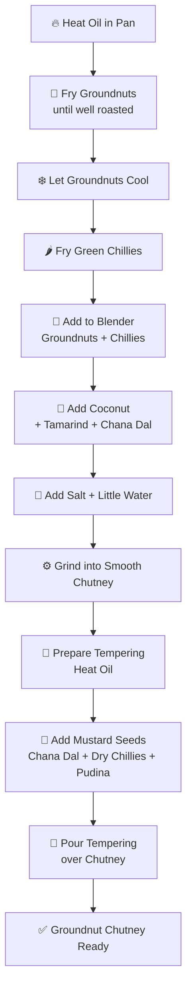

# 🥜 Groundnut Chutney

---

## 🛒 Ingredients

### 🥦 Fresh Ingredients
- Green Chillies – 5 large
- Fresh Coconut – 2–3 small pieces
- Pudina (Mint Leaves) – few leaves
- Tamarind Paste – small piece / ½ tsp

### 🌾 Pulses & Nuts
- Groundnuts / Peanuts – 200 g
- Chana Dal – 1 tbsp (for grinding, optional)
- Chana Dal – 1 tsp (for tempering)

### 🌶️ Spices
- Mustard Seeds – 1 tsp
- Dry Red Chillies – 2
- Salt – 1 tsp (adjust to taste)

### 🧴 Liquids
- Oil – 2–3 tbsp
- Water – as needed for grinding

---

## 🔪 Cutting & Prepping (Do This Before Cooking)

1. Measure **200 g of groundnuts**.
2. Wash and keep **5 green chillies** ready.
3. Cut **fresh coconut into small pieces**.
4. Keep **tamarind paste** ready.
5. Measure **chana dal, mustard seeds, and dry chillies**.

---

## 🍳 Cooking Process

### 1️⃣ Roast the Groundnuts
1. Heat **1–2 tbsp oil** in a pan.
2. Add **groundnuts**.
3. Fry on **medium flame**, stirring regularly.
4. Roast until **well fried and aromatic**.
5. Remove and **allow them to cool completely**.

---

### 2️⃣ Fry the Green Chillies
1. In the same pan, add a little oil if needed.
2. Add **green chillies**.
3. Fry for **1–2 minutes** until slightly blistered.
4. Remove and keep aside.

---

### 3️⃣ Grind the Chutney
Add the following into a **mixie / blender jar**:

- Fried **groundnuts**
- Fried **green chillies**
- **Tamarind paste**
- **Fresh coconut**
- **Chana dal (optional)**
- **Salt**

Steps:
1. Add **a little water**.
2. Grind until it becomes a **smooth chutney**.
3. Transfer the chutney to a **serving bowl**.

---

### 4️⃣ Prepare the Tempering (Tadka)

1. Heat **1 tbsp oil** in a small pan.
2. Add **mustard seeds** and let them splutter.
3. Add:
   - **Dry red chillies**
   - **Chana dal**
   - **Pudina leaves**
4. Fry for **20–30 seconds** until aromatic.

---

### 5️⃣ Final Step
1. Pour the **tempering (tadka)** over the chutney.
2. Mix lightly.

---

## 🍽️ Best Served With
- 🥞 Dosa  
- 🍚 Idli  
- 🍲 Upma  
- 🍛 Pongal  

---

# 🔄 Summary Flow

---

✅ **Simple Tip:**  
If the chutney becomes too thick, add **1–2 tbsp warm water** and mix well.
---
---