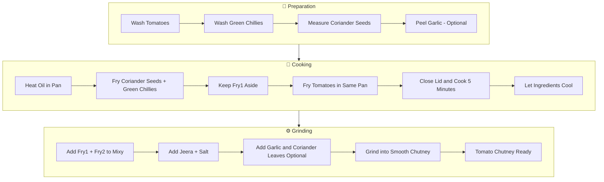

# 🍅 Tomato Chutney

---

## 🛒 Ingredients

### 🥕 Fresh Ingredients

* Tomatoes
* Green Chillies (4)
* Coriander Leaves (optional)
* Garlic – 2 small pieces (optional)

### 🌶️ Spices

* Coriander Seeds – 1 spoon
* Jeelakarra / Jeera – small quantity
* Salt – as required

### 💧 Liquids

* Oil – as required

---

## 🔪 Cutting & Prepping (Do This Before Cooking)

* Wash the **tomatoes and green chillies**
* Keep **coriander seeds and jeera** measured
* Peel **garlic cloves** (if using)
* Keep **mixy / blender ready**

---

## 🍳 Cooking Process

### 1️⃣ Fry Stage 1

1. Heat **oil in a pan**
2. Add:

   * **Coriander seeds (1 spoon)**
   * **Green chillies (4)**
3. Fry for **1–2 minutes**
4. Remove and **keep aside**

---

### 2️⃣ Fry Stage 2

1. In the **same pan**, add a little more oil
2. Add **tomatoes**
3. Close the pan with a lid
4. Cook for **about 5 minutes**
5. Allow the tomatoes to **soften**
6. Remove and **let them cool**

---

### 3️⃣ Mixy / Grinding

Add the following to a **mixy jar**:

* Fried **coriander seeds & chillies**
* Fried **tomatoes**
* **Coriander leaves** (optional)
* **Jeera**
* **Salt**
* **Garlic** (optional)

Steps:

1. Add **a little water if needed**
2. Grind into a **smooth chutney**
3. Transfer to a **serving bowl**

---

## 🔄 3-Stage Cooking Flow

